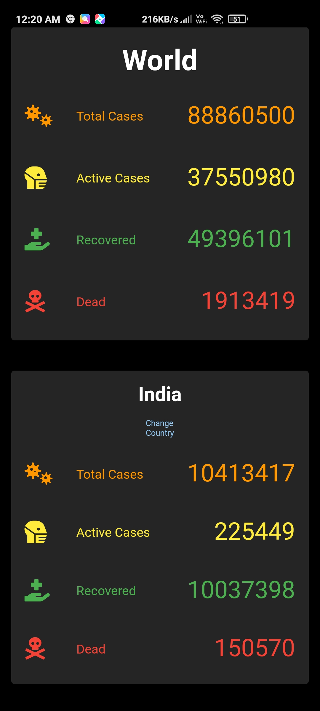
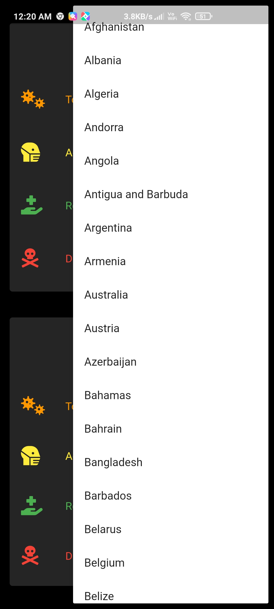
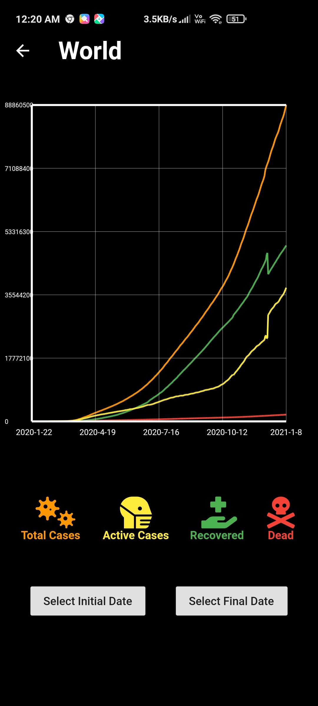

# Covid-19 infection data

This application is made using flutter and allows users to see the total coronavirus cases, active coronavirus cases, recoveries and deaths worldwide and for all those countries whose data is available.

A graph is also made using the data to see the trends over a period of time.

      

